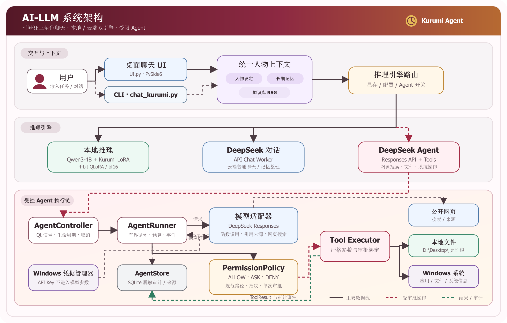

# 时崎狂三 · 本地角色扮演 LLM（桌面版）

《约会大作战》角色「时崎狂三」的角色扮演封装：**Qwen3-4B + LoRA** 微调，带桌面聊天 UI、
长期记忆、设定知识库，以及一个**有审批、有审计、有硬性上限**的 Agent 执行循环
（本地文件 / 只读系统信息 / 网页读取 / 关键词搜索）。

> 训练数据集：HuggingFace `kurumi-sharegpt-cn`　·　LoRA 适配器：HuggingFace `kurumi-qwen3-4b-lora`



---

## 1. 这个项目能做什么

| 能力 | 说明 | 默认 |
|---|---|---|
| **桌面聊天** | 本地 LoRA（4-bit）或 DeepSeek API，两条路共用同一份人设与记忆预算 | 开 |
| **长期记忆** | 每 N 轮自动提炼要点；支持查看 / 纠正 / 遗忘 / 置顶 | 开（每 5 轮） |
| **设定知识库** | `knowledge/knowledge.txt` 里的原作设定，按关键词检索后注入 | 开 |
| **Agent 任务** | 在**允许根目录**内读写文件、读只读系统信息、读网页、搜索关键词 | 开（首次需同意） |
| **会话恢复** | 重启后恢复上次对话；清空 = 开新会话（旧记录保留但不载入） | 开 |
| 永久删除 / 执行 Shell / 越根写入 | **不做**（策略层直接拒绝，审批卡都不会弹） | 关 |
| 无审批的联网 | **不做**：任何外发都要逐次批准，审批卡写明"两段外发" | 关 |

**重要（与旧版不同）**：输入区**没有**「Agent 联网」开关，消息也不再"一律当任务"——
每条消息先做一次**本地意图识别**（不发任何请求）：像任务的（含动作动词，如"帮我建个文件"、
"搜索一下…"）走 Agent，能力未确认时**先征求同意**，拒绝就退回普通聊天（消息不会丢）；
**闲聊**（"你好""今天天气怎么样"）直接按普通聊天回复，不会为一句打招呼就弹付费探测卡。
状态栏右侧的**常驻徽标**随时告诉你下一条消息会怎么走（见 §3.1）。

---

## 2. 快速开始

### 2.1 环境

```powershell
# 1) 虚拟环境（建议 3.11，已在 3.11.9 验证；3.9 及以下会直接报错）
python -m venv venv
.\venv\Scripts\Activate.ps1

# 2) 依赖（**只有一个文件**，含 CUDA 版 torch 的索引）
pip install -r requirements.txt
#    网络不稳时: pip install -r requirements.txt -i https://mirrors.aliyun.com/pypi/simple/ --trusted-host mirrors.aliyun.com

# 3) 确认拿到的是 CUDA 版 torch（本次安装会优先选 2.5.1+cu124）
python -c "import torch;print(torch.__version__, torch.version.cuda, torch.cuda.is_available())"
#    期望 2.5.1+cu124 12.4 True；若显示 2.5.1+cpu/None False，见 §9 第一行

# 只要 API 模式、不想下 4 GB 的本地推理栈：把 requirements.txt 里
# 「本地模型 + LoRA」那一段注释掉再装，然后用 python main.py --no-local 启动。
```

### 2.2 模型权重（只走 API 可跳过）

放到项目根目录即可，**不需要任何参数**（也兼容放在上一级目录）：

```
AI-LLM/models/Qwen3-4B/          # 基座权重
AI-LLM/saves/qwen3-4b-kurumi/    # 狂三 LoRA 适配器
```

### 2.3 运行

```powershell
python main.py                    # 自动选择引擎：显存 ≥ 4 GiB 用本地，否则切 DeepSeek API
python main.py --local            # 强制本地（忽略显存检测）
python main.py --no-local         # 只用 API，不加载本地模型
```

首次执行任务时，界面会先弹一张确认卡（详见 §3.2）——**探测能力会产生 1~2 次真实请求（计费）**。

---

## 3. 界面怎么用

### 3.1 基本操作

| 控件 | 行为 |
|---|---|
| 输入框 + 发送 | 按钮恒为**「发送」**；按下去走哪条路由**意图决定**（闲聊 = 普通聊天，像任务 = Agent） |
| 状态栏右侧徽标 | **常驻**显示"下一条消息会怎么走"：`🛠 任务先征求同意` / `🛠 任务自动执行` / `⚠️ 任务需重新确认能力` / `💬 普通聊天 · Agent 已关闭` |
| 状态栏正文 | **临时**信息（会被下一条消息覆盖）：`💬 普通聊天回复中……` / `🛠 正在执行任务……` / `Agent 任务完成: …` |
| 停止 | 生成 / 整理记忆 / Agent 任务进行中都可用 |
| 记住这段对话 | 立刻整理一次记忆（不等满 5 轮） |
| 清空 | 清空聊天区并**开一段新会话**；排队中的消息一并取消；上一段对话仍留在会话记录里、重启不再载入 |

**分流规则**：只有**像任务**的消息才走 Agent；「继续」「然后呢」「还没好吗」这类
**承接上一轮任务**的短句也会继续交给 Agent（但上一轮走的是普通聊天时不会 —— 那时它就是闲聊）。
识别完全在本地，误判的代价只是"这句按普通聊天答了"：本轮结束后仍会给一个
「执行这个任务」按钮兜底。

### 3.2 第一次执行任务：能力确认卡

只有**像任务**的消息才会弹这张卡（闲聊直接按普通聊天回复，见 §3.1）：

```
【需要主人确认】启用 Agent 能力
这需要向 DeepSeek 端点发起 1~2 次**真实请求**(会计费),其中一次会尝试联网搜索。
• 允许探测:确认后这条消息会作为任务执行(工具调用仍需逐次批准)
• 用普通聊天:不探测、不额外计费,这条消息按普通聊天回复
```

- **允许探测** → 分项探测能力（模型调用 / 函数调用 / 搜索 / 流式），结论缓存在本次运行内；
- **用普通聊天** → 之后的对话都走普通聊天；排队的那几条会**依次**被答完（一条不丢）；
- 探测**瞬时失败**（限流 / 断连）不会永久禁用：再发一条消息会**重新征求一次**同意；
- 探测超过 20 秒没回来：界面停止等待并给出两个按钮（**重新探测** / **用普通聊天**），
  不会把消息无限期挂着。

### 3.3 审批卡

Agent 的每一次外发 / 变更都要**逐次批准**。审批卡如实写明数据流向，例如：

```
⚠️ 两段外发:①搜索关键词会发给搜索引擎;②搜索到的摘要随后会随对话发给 DeepSeek
```

按钮：**允许一次** / **拒绝**。等待审批**不计入**任务的活动超时（上限 30 分钟），
超时则该工具不执行、任务以 `APPROVAL_TIMEOUT` 结束。

### 3.4 记忆命令（在输入框直接输入）

```
/记忆                        查看已记住的内容(带序号)
/忘记 <序号或关键词>          让某条记忆失效
/纠正 <序号或关键词> <新内容>  改写某条记忆
/置顶 <序号或关键词>          置顶(预算紧张时仍会注入)
/取消置顶 <序号或关键词>       取消置顶
```

命令前可省略 `/`（如「忘记咖啡」也认）；认不出的 `/xxx` 会**按普通消息发送**，绝不吞掉输入。

---

## 4. 配置 `api/api_config.json`

复制 `api/api_config.example.json` 为 `api/api_config.json` 后按需修改（该文件已 gitignore）。
路径只有一处权威来源：`agent/config.py` 的 `DEFAULT_CONFIG_PATH`，界面与 Agent 都读它。

```json
{
  "base_url": "https://api.deepseek.com",
  "chat_model": "deepseek-v4-flash",
  "agent_model": "deepseek-v4-flash",
  "credential_id": "kurumi-deepseek",
  "allowed_hosts": ["https://api.deepseek.com"],
  "agent": {
    "enabled": true,
    "allowed_root": "",
    "extra_tools_enabled": false,
    "web_tools_enabled": false,
    "web_search_enabled": false,
    "web_search_proxy": ""
  }
}
```

**API Key 的取用顺序**：`api/api_config.json` 的 `api_key` → 环境变量 `DEEPSEEK_API_KEY`
→ **Windows 凭据管理器**（推荐）。检测到明文 Key 时会弹「迁移到凭据管理器」确认卡；
拒绝迁移则 Agent 保持禁用（明文 Key 不落库、不入审计）。

### 4.1 `agent` 段全部键

| 键 | 默认 | 含义 |
|---|---|---|
| `enabled` | `true` | 总开关（关掉则消息全走普通聊天） |
| `allowed_root` | 空 = **当前用户桌面** | Agent 可自由读写的根目录；填**绝对路径**。空串 / 相对路径回落到桌面，不会变成磁盘根 |
| `stream` | `true` | Agent 正文增量上屏；端点不支持会自动退回非流式 |
| `extra_tools_enabled` | `false` | 额外工具：`open_item`（打开文件/网址/启动应用）、`system_info`（只读系统信息） |
| `web_tools_enabled` | `false` | 网页读取 `web_fetch`（每次调用仍需审批） |
| `web_timeout_seconds` | `10` | `web_fetch` 超时 |
| `web_search_enabled` | `false` | 关键词搜索 `web_search`（需先 `pip install ddgs`） |
| `web_search_proxy` | 空 = 直连 | 例 `http://127.0.0.1:10809`；**不接受带用户名/密码的地址**（会拒绝并说明）。也可用环境变量 `KURUMI_SEARCH_PROXY` |
| `web_search_engine` | `auto` | 交给 ddgs 在可用引擎间取舍（也可写 `bing` / `mojeek` 等） |
| `web_search_timeout_seconds` | `15` | 库自身超时；应用侧另加 5 秒硬截止 |
| `web_search_max_results` | `5` | **模型没给 `count` 时**的默认条数（模型显式要求时以模型为准，硬上限 10） |
| `web_search_allow_private` | `false` | 放行 `web_fetch` 的私网地址（键名带 search，实际只作用于网页读取） |
| `max_tool_calls` / `max_model_rounds` | `8` / `10` | 单任务的工具调用与模型往返上限 |
| `max_model_retries` | `4` | 瞬态模型错误的额外重试预算（按整次运行计） |
| `active_timeout_seconds` | `120` | 活动执行时间上限（**不含**审批等待） |
| `approval_timeout_seconds` | `1800` | 等待审批的硬上限 |
| `max_output_tokens` | `8192` | Agent 单轮输出预算 |
| `retention_days` | `30` | 审计库保留天数 |

### 4.2 搜索：为什么常需要代理，以及"出口"是怎么被锁住的

受限网络下 `ddgs` 需要代理才能打通搜索引擎。**代理出口会被绑定到审批里**：

- `prepare` 阶段把"配置代理 → 环境变量 `DDGS_PROXY` → 系统代理"解析成**唯一出口**，
  连同来源写进审批快照 —— 你批准的就是真的会被用的；
- 搜索库本身会自己读 `DDGS_PROXY` / `HTTP(S)_PROXY`（`proxy=None` 与空串都会），
  所以应用**不允许**"空代理=直连"这种含糊状态：要么显式绑定，要么**拒绝本次搜索**；
- 配置写错（带凭据、端口非法、协议不认识）→ 返回 `PROXY_INVALID` 并说明怎么改，
  **不会**悄悄改直连（直连会暴露真实出口 IP）；
- 批准之后改了出口（换代理 / 环境变量变化）→ 旧授权作废，需要重新发起。

### 4.3 硬性限制（模型无法覆盖）

| 项目 | 值 |
|---|---|
| 单任务工具调用 | ≤ 8 次 |
| 模型往返轮次 | ≤ 10 轮 |
| 活动执行时间 | ≤ 120 秒（审批等待不计） |
| 写文件内容 | ≤ 1 MiB / 次 |
| 读文件 | ≤ 400 行且 ≤ 256 KiB / 次 |
| 读网页 | ≤ 256 KiB（边读边限，不是读完再截断）、正文 ≤ 2 万字符 |

### 4.4 权限矩阵

| 操作 | 允许根目录内 | 根目录外 |
|---|---:|---:|
| 列出 / 搜索普通文件 | 自动 | 需批准 |
| 读取普通文本 | 自动 | 需批准 |
| 读取疑似敏感文件（.env / 密钥 / 证书等） | 需批准 | 需批准 |
| 新建 / 修改 / 覆盖 / patch / 移动 / 回收 | 需批准 | **拒绝** |
| 启动应用 / 打开文件 / 打开 http(s) 网址 | 需批准 | 需批准 |
| 读取 http/https 网页（`web_fetch`，默认关） | 需批准 | 需批准 |
| 关键词搜索（`web_search`，默认关） | 需批准 | 需批准 |
| 只读系统信息 | 自动 | 自动 |
| 执行程序 / Shell / 永久删除 | 拒绝 | 拒绝 |

「根目录外变更」是 **DENY**（审批卡都不会弹），**没有开关可以打开**：确需在别处读写时，
把 `agent.allowed_root` 指向正确的目录。回收走 Windows 回收站，不提供永久删除。

---

## 5. 数据与隐私

| 文件 | 内容 | 说明 |
|---|---|---|
| `agent_data/agent.db` | Agent 运行审计（事件、审批、工具记录、结构化结果） | 只存**脱敏**数据；默认保留 30 天；不含 API Key / Cookie / 完整敏感文件内容 |
| `agent_data/memory.db` | 长期记忆 + 会话轮次 | 会话是"重启恢复"的权威来源 |
| `memory/memory.json` | 记忆的 JSON 镜像 | 兼容旧版、数据库为空时的回退来源；损坏时会改名留档而不是静默丢弃 |
| `agent_data/*.before-turn-repair-*` | 历史数据修复前的整库备份 | 只在做过迁移修复时出现，可安全删除 |

**会话语义（看清楚再按「清空」）**

- 重启恢复**最新会话**的最近 40 条轮次；更早的仍在库里；
- 发送时就把你的话落盘（进程被杀也不丢）；失败 / 取消会把这一次的落盘**回滚**，不会留下孤立轮次；
- 崩溃残留的"没得到回答的提问"会**保留**在库里并标记为未完成，但**不再带入上下文**
  （否则会得到两条 `user` 挨着的坏序列）；
- 清空 = 开新会话：屏幕清干净、重启不再载入，上一段对话仍留在会话记录里（不可逆删除留给回收站，不在这里）；
- 恢复"上次 Agent 结果"只认**当前会话**的运行记录，旧会话的任务不会跨过清空边界回来。

**什么会离开本机**

- 聊天 / Agent 的对话内容 → DeepSeek 端点（你的 `base_url`，非官方域名需先确认）；
- `web_fetch`：目标网址发给该站点，正文随后随对话发给 DeepSeek；
- `web_search`：关键词发给搜索引擎，摘要随后随对话发给 DeepSeek（审批卡原文如此标注）。

API 域名有白名单门禁（`allowed_hosts`）；换非官方域名会先弹确认卡。

---

## 6. 命令行参数

启动入口是 **`main.py`**（`python main.py --help` 可查全部参数）：

| 参数 | 默认 | 说明 |
|---|---|---|
| `--base` / `--adapter` | `models/Qwen3-4B` / `saves/qwen3-4b-kurumi` | 基座与 LoRA 目录 |
| `--local` / `--no-local` | 自动 | 强制本地 / 只用 API（忽略显存检测） |
| `--no-quantize` | 关 | bf16 全精度加载（需 ≥ 8 GiB 显存） |
| `--min_vram_gb` | `4.0` | 自动模式下选择本地模型所需的最小显存余量 |
| `--temperature` / `--top_p` | `0.7` / `0.9` | 采样参数（思考模式下会被端点忽略） |
| `--max_new_tokens` | `2048` | 单轮输出预算（思考与正文共享） |
| `--remember_every` | `5` | 每 N 轮自动整理记忆；`0` 禁用 |
| `--history_max_chars` | `16000` | 对话历史上限，超出裁剪旧内容 |
| `--api_timeout_seconds` | `45` | API 请求超时 |
| `--api_thinking` | `disabled` | DeepSeek 思考模式：`disabled` / `low` / `high` / `max` |
| `--stream_stall_timeout` | `60` | 本地生成流停滞判定 |
| `--shutdown_wait_ms` | `2000` | 关窗时等待任务结束的毫秒数 |

**关于思考模式**：DeepSeek 默认开启思考，`max_tokens` 是思考与正文**共享**的预算 ——
同一提问在 `--max_new_tokens 160` 下实测开启思考 3/3 空回复、关闭 0/3；思考模式下
`temperature` / `top_p` 等会被**静默忽略**。所以要开思考就同时把 `--max_new_tokens` 调大（≥1024）。

**引擎自动选择**：启动检测显存余量，≥ `--min_vram_gb` 用本地 LoRA，否则自动切 DeepSeek API；
两者都不可用时给出明确提示，不硬加载。
判定用的是 **nvidia-smi 报的实际空闲值**（CUDA 自报的值在 Windows 上会把"驱动能从别的程序
回收的显存"也算成空闲，偏乐观 0.7~0.8 GiB，只看它会出现"判定够 → 加载时抢不到显存"）。
本地模型**加载失败**且 API 可用时，会**自动改用 API**并在状态栏说明，不必手动重试。

**显存 / 内存建议**

| 模式 | 显存 | 内存 |
|---|---|---|
| 本地 4-bit QLoRA（默认） | ≥ 4 GiB，推荐 6 GiB | ≥ 8 GiB，推荐 16 GiB |
| 本地 bf16（`--no-quantize`） | ≥ 8 GiB | ≥ 12 GiB |
| 仅 API（`--no-local`） | 无要求 | ≥ 4 GiB |

> 本地加载的常见坑：**虚拟内存（页面文件）不足**会报 `OSError: 页面文件太小 (os error 1455)`，
> 设为「自动管理」或手动 ≥ 16 GiB；加载前关掉占显存的程序。

---

## 7. 自检与调试

本项目**不含自动化测试**（`tests/` 与 `test_core.py` 已按主人要求移除），
仓库里的检查只有静态 lint 与冒烟：

```powershell
pip install -r requirements.txt      # ruff 也在里面
ruff check .                        # 静态检查(规则与 ignore 理由见 pyproject.toml)
python -m ruff check . --select F821    # 单独查"未定义名"这一类问题
python -m compileall -q .           # 语法自检(编译全部 .py,不需要推理栈)
python -c "import UI"               # 冒烟:界面模块能 import
python main.py --help               # 冒烟:命令行参数能解析
```

改动之后**必须手工验证**的路径（没有自动化测试兜底）：

| 改动 | 至少要手工确认 |
|---|---|
| 权限策略 / 工具（`agent/tools/*`） | 允许根目录内读自动、写需批准；根目录外写被**拒绝**；回收走回收站 |
| 网页 / 搜索（`agent/tools/web.py`） | 审批卡写明"两段外发"；代理写错返回 `PROXY_INVALID` 而不是悄悄直连 |
| 会话与记忆（`memory/store.py`、`ui/__init__.py`） | 重启恢复上次对话；清空=开新会话且重启不再载入；失败回合不留孤立轮次 |
| 能力探测 / 卡片（`ui/__init__.py`） | 首次任务先征求同意；拒绝后消息改走普通聊天且不丢；探测超时有可点的出路 |
| 界面（`ui/*.py`） | 气泡换行与宽度正确（长 token / 中英混排） |
| 本地模型（`ui/workers.py`、`ui/constants.py`） | 本地生成不空回复、不重复、不半途截断 |

---

## 8. 目录结构

```
AI-LLM/
├── main.py                  启动入口(命令行参数 → 建窗口 → 跑事件循环)
├── ui/                      界面(ui 系列)
│   ├── __init__.py          主窗口 KurumiWindow(双引擎 + Agent)
│   ├── constants.py         界面可调常量(气泡宽度、生成参数、超时)
│   ├── text.py              气泡文本与几何(换行 / 宽度 / 重排)
│   ├── widgets.py           气泡与卡片的控件构建
│   ├── dialogs.py           信任根写入与对话框文案
│   └── workers.py           后台线程(加载模型 / 生成 / API 聊天 / 记忆整理)
├── persona/                 角色设定(人设卡:SYSTEM_PROMPT + PersonaProfile)
├── knowledge/               知识库(检索逻辑 + 可编辑的知识条目)
│   └── knowledge.txt        原作设定条目 —— 想加设定就改这里
├── kurumi/                  角色运行时(kurumi 系列)
│   ├── context.py           上下文预算与结构化组装
│   ├── conversation.py      会话服务(轮次 / 回滚 / 裁剪)
│   └── memory.py            长期记忆(提炼 / 去重 / 防误清空 / JSON 镜像)
├── memory/                  记忆与存储(memory 系列)
│   ├── model.py             记忆的数据模型与纯函数(不含 IO)
│   ├── store.py             记忆与会话的 SQLite 存储(含 schema 迁移)
│   ├── commands.py          /记忆 /忘记 /纠正 /置顶 命令
│   └── memory.json          记忆 JSON 镜像(不入库)
├── api/                     DeepSeek 接入(api 系列)
│   ├── config.py            配置解析与凭据 / 主机授权
│   ├── api_config.example.json  配置模板(入库)
│   └── api_config.json      你自己的配置(不入库)
├── task_intent.py           任务意图识别
├── runtime_control.py       取消令牌(聊天与 Agent 共用)
├── chat_params.py           DeepSeek 思考模式控制
├── agent/                   Agent 包
│   ├── config.py            配置解析(保守降级,绝不扩大权限)
│   ├── credentials.py       Windows 凭据管理器读写 + 明文 Key 迁移
│   ├── policy.py            权限策略(ALLOW / ASK / DENY)
│   ├── prompt.py            系统提示与人设注入
│   ├── runner.py            执行循环(轮次/上限/取消/审批)
│   ├── controller.py        UI 侧 Qt 桥(事件、能力探测代次)
│   ├── audit.py             脱敏
│   ├── store.py             审计 SQLite(运行/事件/审批/结构化结果)
│   ├── task_result.py       交付结果的结构化事实
│   ├── model/deepseek.py    DeepSeek Responses API 适配器
│   └── tools/               工具:base / files / system / web / executor
├── assets/architecture.png  架构图(README 展示用)
├── models/ · saves/         基座权重与 LoRA(不入库)
├── agent_data/              审计与会话数据库(不入库)
├── pyproject.toml           ruff 配置
└── requirements.txt         全部依赖(**一个文件**,含验证过的版本号)
```

**数据文件各归其位**(与代码同域):

| 文件 | 位置 | 入库? |
|---|---|---|
| API 配置(活配置) | `api/api_config.json` | 否(gitignore) |
| API 配置模板 | `api/api_config.example.json` | 是 |
| 记忆 JSON 镜像 | `memory/memory.json` | 否(gitignore) |
| 审计与会话数据库 | `agent_data/*.db` | 否(gitignore) |
| 知识库条目 | `knowledge/knowledge.txt` | 是(想加设定就改它) |

---

## 9. 常见问题

| 现象 | 原因与处理 |
|---|---|
| `ModuleNotFoundError: No module named 'PySide6'` | 依赖没装：`pip install -r requirements.txt` |
| `torch.cuda.is_available()` 为 `False` | 装到了 CPU 版 torch：`pip install --force-reinstall --index-url https://download.pytorch.org/whl/cu124 torch==2.5.1`
| 运行时提示"启动入口是 main.py" | 用了旧命令：改跑 `python main.py` |
| 发「你好」没弹 Agent 确认卡 | 正常：闲聊按普通聊天直接回复，只有像任务的消息才走 Agent（§3.1） |
| 本地模型加载失败但还能聊 | 已自动切到 DeepSeek API（状态栏会写明）；腾出显存后可点「重新加载模型」再试本地 |
| `OSError: 页面文件太小 (os error 1455)` | 虚拟内存不足：设为自动管理或 ≥ 16 GiB |
| 界面提示「Agent 未在配置中启用」 | `api_config.json` 的 `agent.enabled` 为 false |
| 界面提示「未找到 DeepSeek 凭据」 | Key 既不在配置也不在凭据管理器：填 `api_config.json` 或迁移到凭据管理器 |
| 搜索返回 `NOT_INSTALLED` | 没装搜索库：`pip install ddgs`（或把 `requirements.txt` 里的 ddgs 那一段装回来） |
| 搜索返回 `PROXY_INVALID` | 代理地址写错 / 带凭据：按提示改 `agent.web_search_proxy`（只写 `协议://主机:端口`） |
| 搜索一直超时 | 受限网络需要代理：配置 `web_search_proxy`，或确认代理可用 |
| 状态栏提示"消息退回普通聊天" | Agent 不可用时的正常退回（原因就在状态栏那句话里） |
| 想彻底重置会话 / 记忆 | 关闭程序后删 `agent_data/memory.db`（会话与记忆）或 `agent_data/agent.db`（审计） |

---

## 10. 角色设定（简）

- **身份**：时崎狂三，《约会大作战》代号「梦魇」的最恶精灵
- **外貌**：黑色长双马尾、红黑哥特裙、右眼血红、左眼金色时钟之眼（人形，无尾巴）
- **能力**：天使「刻刻帝」（巨大时钟 + 一长一短两把枪），十二发子弹操控时间，消耗自身「时间」需吞噬补充
- **身世**：因「空间震」由人类少女化为精灵，梦想回溯三十年杀死最初的精灵
- **口癖**：称呼对方「主人」，「啊啦啊啦 / 呵呵 / 贵安」，纯中文

## 许可

仅供个人学习研究使用，角色形象版权归原作者所有。
